# An information package for understanding single shot multi-box detector

This package aims to provide precise and enough information that can help to understand an object detection algorithm called single shot multi-box detector (SSD). 

I have seen engineers use binding boxes to mark regions of interest in a figure for many times, and I finally learn a method to perform this magic in Udacity’s self-driving car courses. Unfortunately, this method is less accurate. Now, I understand that the professors in Udacity carefully design the object detection assignment, which contains many crucial ideas behind state-of-the-art object detection methods. However, I did not like the method in the days. An algorithm will be less useful if its accuracy depends on manually adjusting parameters. One day, the Udacity’s research channel was discussing R-CNN, SSD and YOLO. I thought that these algorithms were great. I cannot explain that why I choose the SSD, but I just need a better algorithm to finish the assignment.   

Technically, we can write an SSD from the beginning to the end. However, this strategy will fail due to minor negligence in the program. Also, it will be better if we can quickly focus on the essential knowledge points as we do in Udacity’s class. That is why I share this information package. Hopefully, it contains precise and enough information to understand the SSD.

- Theoretical Knowledge
    1. CNN Architectures ([https://youtu.be/DAOcjicFr1Y](https://youtu.be/DAOcjicFr1Y)).
    2. Detection and Segmentation ([https://youtu.be/nDPWywWRIRo](https://youtu.be/nDPWywWRIRo)).
    3. Object Detection Using Convolutional Neural Networks ([https://gluon.mxnet.io/chapter08_computer-vision/object-detection.html](https://gluon.mxnet.io/chapter08_computer-vision/object-detection.html)).
    4. Train SSD on Pascal VOC dataset ([https://gluon-cv.mxnet.io/build/examples_detection/train_ssd_voc.html#sphx-glr-build-examples-detection-train-ssd-voc-py](https://gluon-cv.mxnet.io/build/examples_detection/train_ssd_voc.html#sphx-glr-build-examples-detection-train-ssd-voc-py)).

    (Non-English)
    
    5. 单发多框检测（SSD）([http://zh.gluon.ai/chapter_computer-vision/ssd.html](http://zh.gluon.ai/chapter_computer-vision/ssd.html))
    6. 动手学深度学习第七课：物体检测 ([https://youtu.be/bqqlNu6byso](https://youtu.be/bqqlNu6byso))
    7. 动手学深度学习第八课：物体检测·续 ([https://youtu.be/LLLC_mMRcSk](https://youtu.be/LLLC_mMRcSk))
    8. 动手学深度学习第九课：物体检测·再续 ([https://youtu.be/8PeT2dknu2s](https://youtu.be/8PeT2dknu2s))
- Additional Explication
    
    Some common topics cannot be found in the above resources. I share my ideas with this package and appreciate better ideas, especially, when you do not agree with them.
    1. The CNN along can be used to classify things without fully connected layers.
    2. b)	The reason that SSD estimates relative coordinates of binding boxes is that CNN shares their weights. As shown below, there are two blocks of features which represent a pair of snake twins. When the filter (blue rectangle) finds one head of snake at position A, it estimates a binding box (red rectangle). Then, when the filter moves to position B and finds another snake’s head, it should estimate a binding box with the same size. Note that the estimation is performed by the same CNN with the same weights, so it is impossible to give absolute coordinates of binding boxes. 
    
    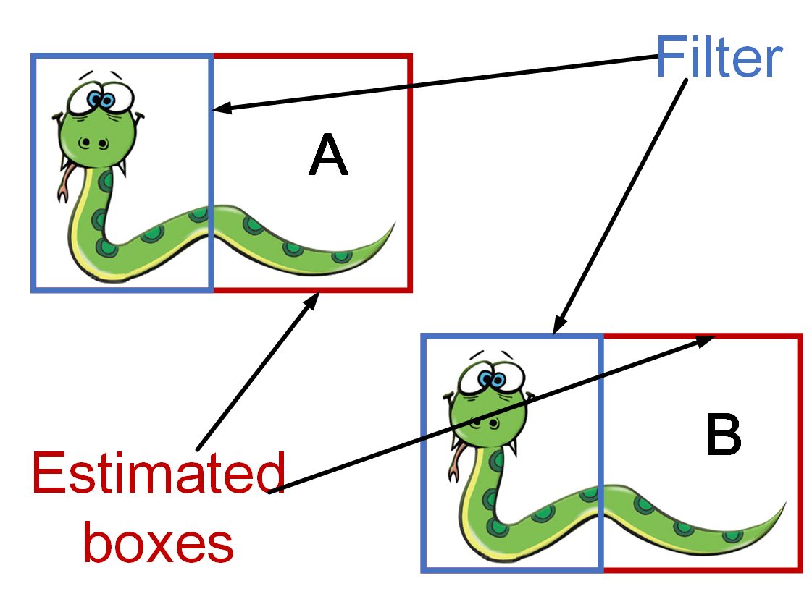

- Datasets
    1. PASCAL VOC Datasets ([https://gluon-cv.mxnet.io/build/examples_datasets/pascal_voc.html#sphx-glr-build-examples-datasets-pascal-voc-py](https://gluon-cv.mxnet.io/build/examples_datasets/pascal_voc.html#sphx-glr-build-examples-datasets-pascal-voc-py))
    2. Udacity’s Driving Datasets ([https://github.com/udacity/self-driving-car/tree/master/annotations](https://github.com/udacity/self-driving-car/tree/master/annotations)).
        
        Usage:
        1. Download files “object-detection-crowdai.tar.gz” ([http://bit.ly/udacity-annoations-crowdai](http://bit.ly/udacity-annoations-crowdai)) and “object-dataset.tar.gz” ([http://bit.ly/udacity-annotations-autti ](http://bit.ly/udacity-annotations-autti )). 
        2. Decompress the above two files to the same folder. They should contain no file with the same name. 
        3. Remove the first line of “labels_crowdai.csv” and save it to the same folder with name “labels_crowdai_clean.csv.” 
        
        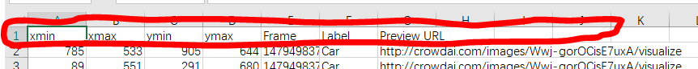

        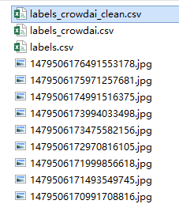
        
        4. Open "testUdacityDatasets.py" and change the variable “dataDir” (Line 27) to the folder. Run “testUdacityDatasets.py” to make sure that everything is on track. There should be 21601 images because some bad samples are filtered. The interface of Udacity’s Driving datasets is in “MxNetUdacity_tools.py” and “MxNetUdacity_tools1.py.”
- Virtual machine
    
    The cheapest GPU instance that I can find is the “p2.xlarge windows spot instance” in Amazon Web Service. The GPU driver installation guide can be found in [https://docs.aws.amazon.com/AWSEC2/latest/WindowsGuide/install-nvidia-driver-windows.html](https://docs.aws.amazon.com/AWSEC2/latest/WindowsGuide/install-nvidia-driver-windows.html). After the installation, some parameters should be optimized ([https://docs.aws.amazon.com/AWSEC2/latest/WindowsGuide/optimize_gpu.html](https://docs.aws.amazon.com/AWSEC2/latest/WindowsGuide/optimize_gpu.html)). At last, CUDA should be installed ([https://developer.nvidia.com/cuda-downloads](https://developer.nvidia.com/cuda-downloads)). 
- Codes

    The codes in this package are extracted from a beautiful program called Gluon-CV ([https://gluon-cv.mxnet.io/index.html](https://gluon-cv.mxnet.io/index.html)). First, the software architecture of Gluon-CV is delicately designed, we can see how an SSD is composed. Second, the default parameters are well chosen, and the experiment shows that they can adapt the Udacity’s datasets. Then, the Gluon-CV contains all the functions that the SSD needs to work with but do not belong to the primary structures. We can focus on the SSD itself. Above all, it contains many pre-trained models whose training conditions are recorded. These models can be comfortably used as the base network of the SSD. But, the original codes in Gluon-CV must adapt kinds of conditions, which makes them contain too many codes that will divert readers’ attention. I try to remove these codes. The program in this package is less robust than the original Gluon-CV codes, but it is easier to follow. Furthermore, there is no validation in the package for it is not directly associated with understanding the SSD. The well-designed validation codes can be found in [https://gluon-cv.mxnet.io/_downloads/train_ssd.py](https://gluon-cv.mxnet.io/_downloads/train_ssd.py). 
    
    1. Crosscheck2.py. Train an SSD on Pascal VOC dataset with GPU.
    2. Crosscheck1.py. Show the training results of “Crosscheck2.py.”
    3. Crosscheck2_GPU.py. Train an SSD on Pascal VOC dataset with all the GPUs in a computer.
    4. Crosscheck3.py. Train an SSD on Udacity’s Driving Datasets with all the GPUs in a computer.
    5. Crosscheck11.py. Show the training results of “Crosscheck3.py.”
    
- Results
    My SSD is trained on Udacity’s Driving datasets for only two epochs, and it gives acceptable results. The training process is terminated for two reasons. First, the object “DataLoader” in “MxNet” do not support multiprocessing on Windows. The reading process on “p2.xlarge” is relatively slow. I do not have enough money to run virtual machines on AWS. Second, there are too few samples of traffic lights and pedestrians in the database. Additional codes should be used to fix this problem, which is beyond my learning plan. You can see the cars are well recognized, but traffic lights and pedestrians are not.

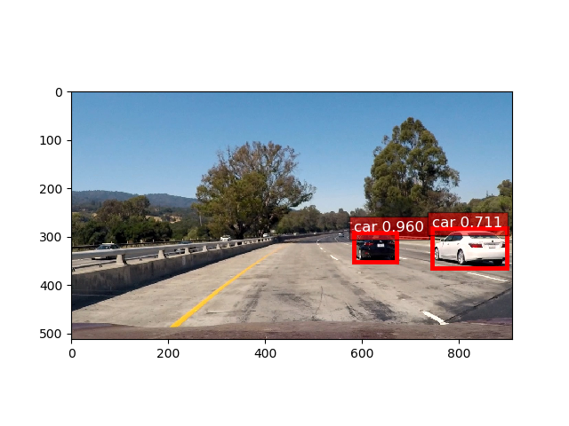

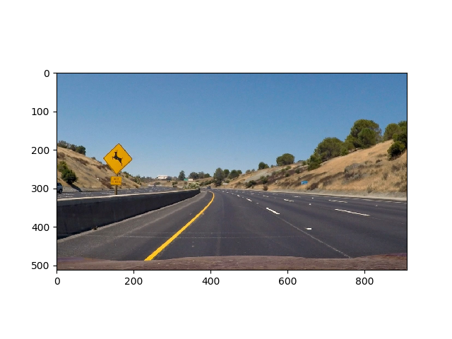

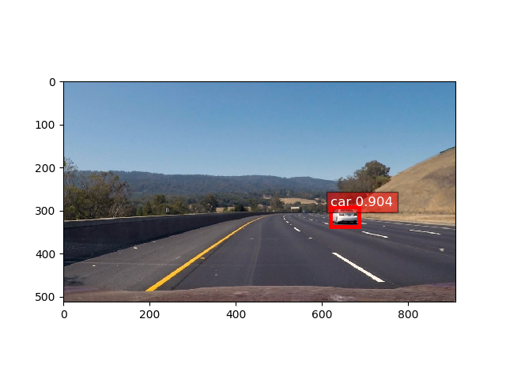

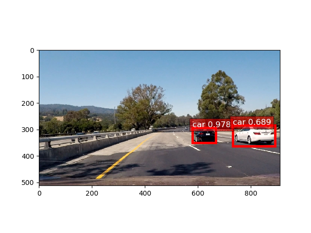

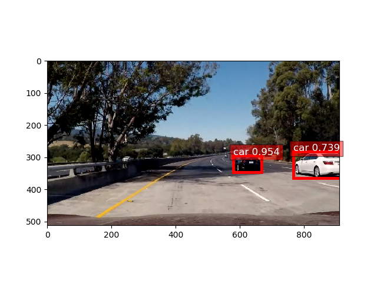

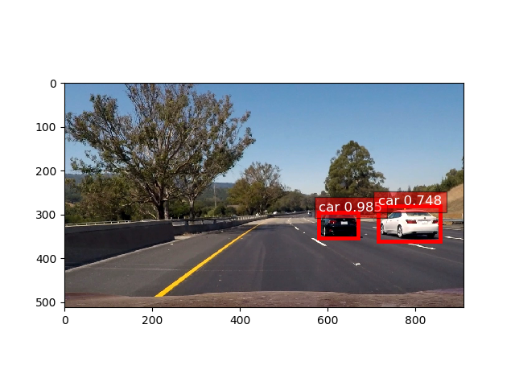

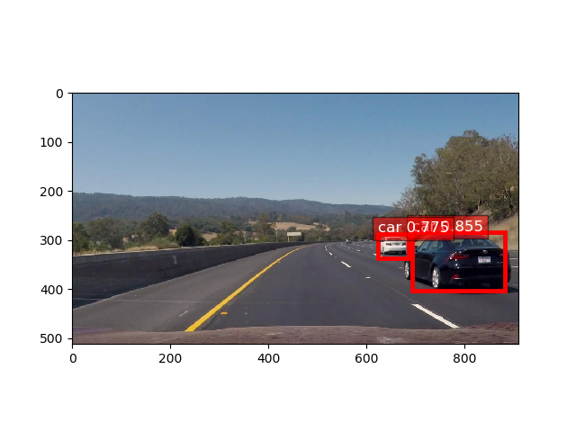

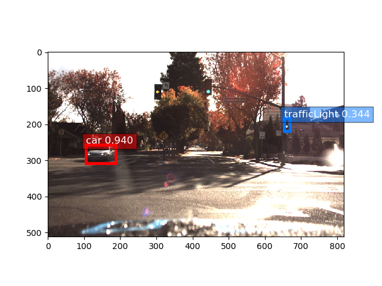

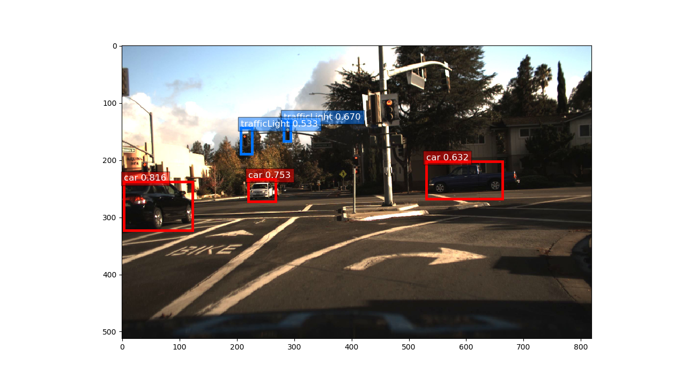

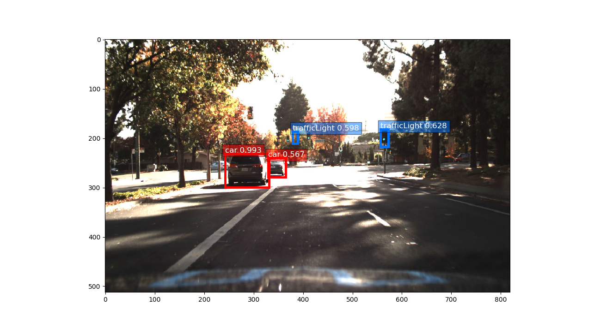

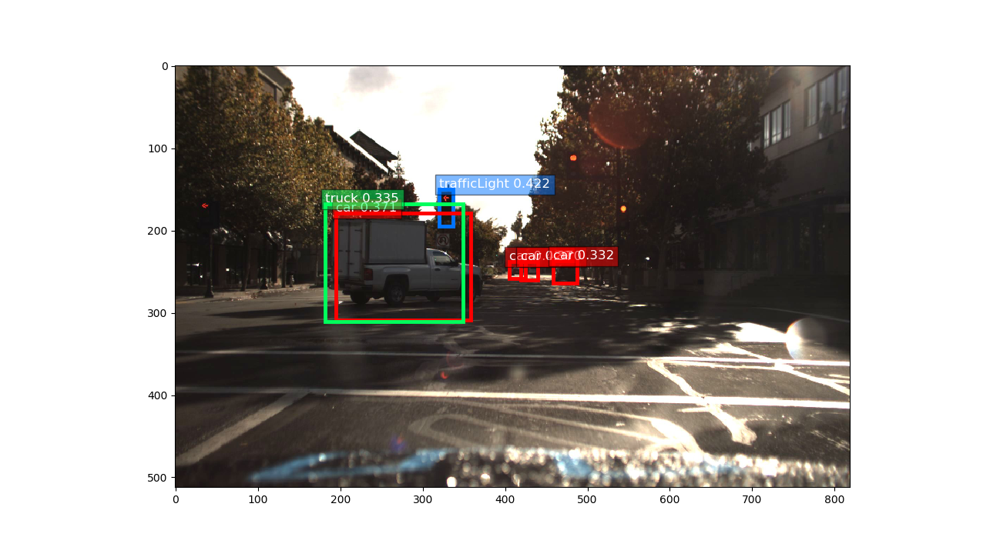

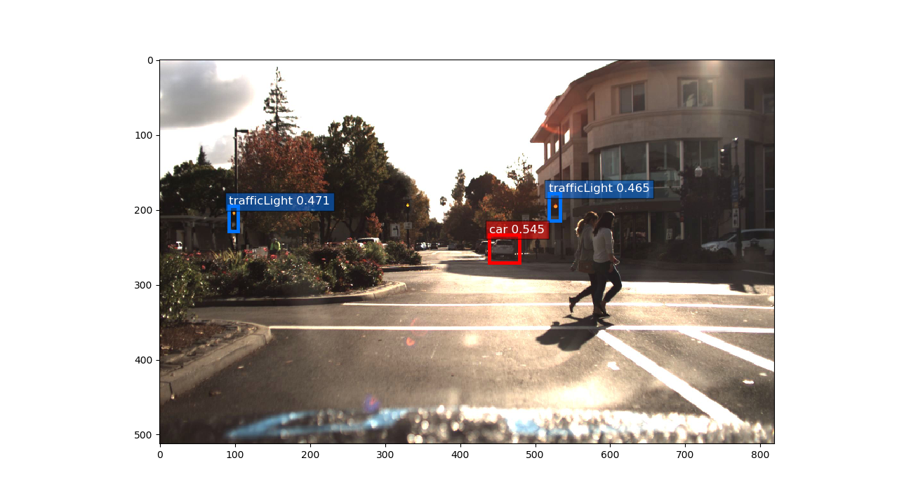

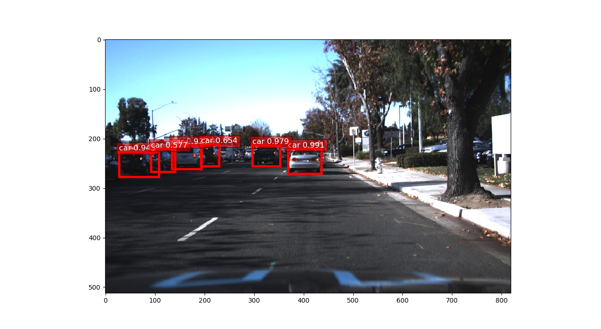
